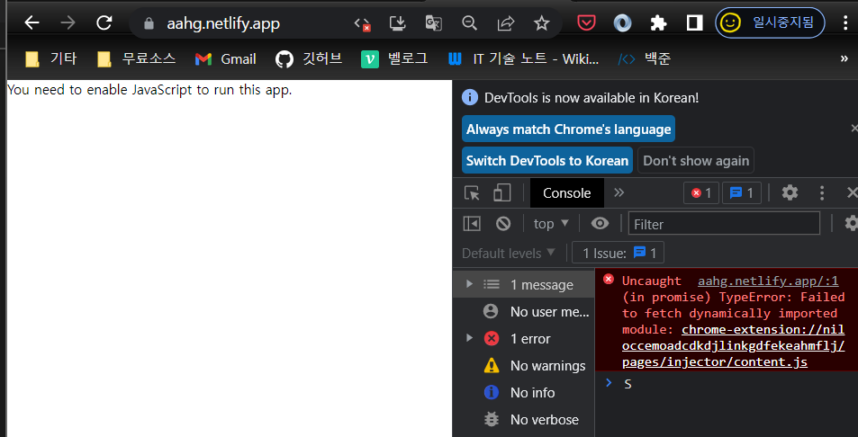
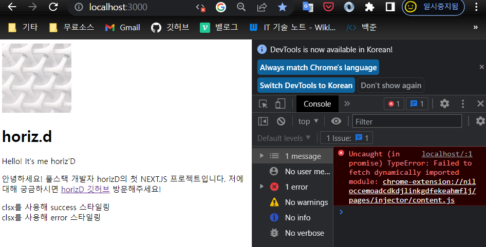
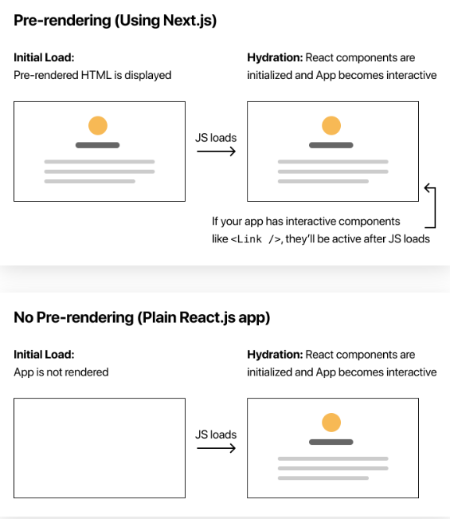
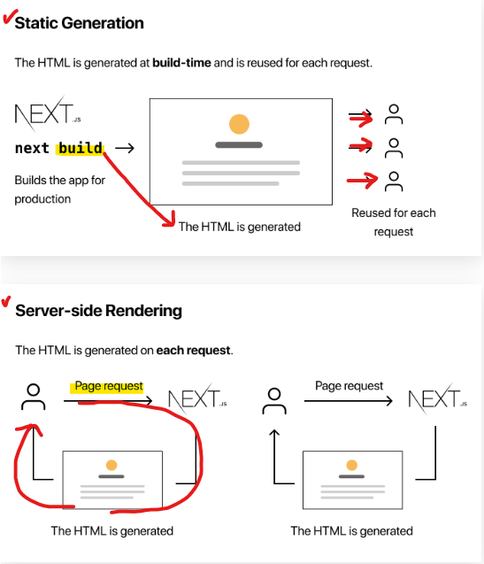
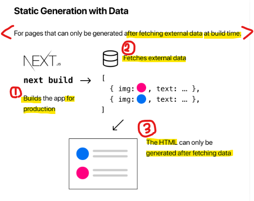
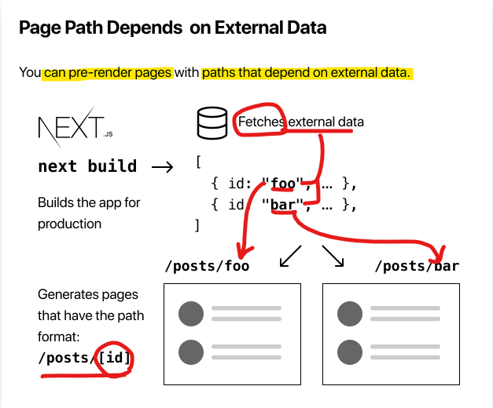

# Next.js 기록

## 1. `<Link>` component 는 동일 Next.js app의 여러 두 페이지 간 client-side navigation을 가능하도록 한다.
   - 즉, Link를 통해 페이지를 옮겨가지만, client-side 네비게이션을 수행하여, 전체 페이지를 리로드하지 않는다.
   - 이는, 홈이 먼저 로드될 때 다른 페이지들의 코드는 로드하지 않는다는 말이며, 각 페이지들이 격리된다는 뜻이다.
   - 마치 리액트처럼 동작하여, 수백개의 페이지여도 빠르게 로드 가능하게 한다.
   - `<a>`태그를 사용하면, full-page를 로드한다.
   - 그리고, 일단 Link컴포넌트가 브라우저 뷰포트에 나타날 때, 즉 Link가 있는 페이지가 렌더될 때, Linked된 페이지의 코드를 백그라운드에서 prefetches한다. 즉 먼저 가져와놓는다는 말이다. 이를 통해 백그라운드에서 이미 로드된 목적페이지가 버튼 등을 통한 이벤트가 발생했을 때, 거의 즉시 보여지게 된다.
   - 요약하자면, code splitting, client-side navigation, prefetching을 통해 최고의 앱 최적화 성능을 보여줄 수 있다.

<br>

## 2. Assets, Metadata, and CSS
- Next.js는 Image컴포넌트를 `next/image`에서 제공한다. 이는 img태그의 확장 컴포넌트이다.
- 이는, default로 이미지 resizing, optimizing, 그리고 WebP같은 모던포맷으로 이미지를 전달해준다(브라우저가 지원하는 한).
- 이미지 최적화는 심지어는 외부데이터소스에서 호스트된 이미지까지 포함할정도로 어떤 이미지 소스에 대해서도 수행한다.
- Next.js는 이미지를 빌드 시 최적화하지 않고, 사용자의 요청에 따른 온디맨드로 최적화한다. 정적 사이트 생성기와 다르게 이미지의 개수와 상관없이 빌드타임이 길어질 일이 없다는 뜻이다.
- 이미지는 뷰포트에 들어와야만 로드된다. 사용자가 스크롤하여 해당 이미지에 도달해야 그것을 로드한다.


... 이외 각 파일 내 주석으로 대체.
<br>

## 3. pre-rendering, data fetching
Next.js는 기본적으로, 모든 페이지를 사전렌더링 한다.<br>
즉, Nextjs는 클라이언트사이드 js에서 모든 작업을 수행하지 않고 미리 각 페이지에 대한 HTML을 생성한다.<br>

사전 렌더링은 더 나은 성능과 SEO를 가능케 한다.
<br>

미리 생성된 각 HTML은 해당 페이지에 필요한 최소한의 JS코드와 연결된다. 페이지가 브라우저에 의해 로드되면 해당 JS코드가 실행되어 페이지가 완전히 상호작용되도록 한다.(It is called hydration)


<br>

### Chrome에서 javascript disabled를 수행한 후 리액트 앱에 접근한 모습.


<br>

### Chrome에서 javascript disabled를 수행한 후 NEXTJS 앱에 접근한 모습.


<br><br>
위에서 볼 수 있다시피, 크롬(브라우저)의 js엔진을 disable 한 뒤 접근했을 때,<br>
순수 React.js기반의 앱은 어떠한 유효한 HTML페이지도 로드하지 못한 반면 <br>
Next.js기반의 앱은, 최소한의 js코드에 연결되지 못했을 뿐, Pre-rendered된 정적 HTML페이지를 로드하였다.

<br>



이것은 React가 CSR을 수행하여, 클라이언트(즉, JS)가 HTML요소를 js에 기반하여, 애초에 interactive한 컴포넌트를 만들어내기 때문이다.

반면 next.js는 정적 HTML을 pre-rendering해둔 후, 해당 페이지가 로드될 때, js를 연동시켜 interactive하게 만들어주기 때문에 js없이도 정적 HTML을 볼 수 있는 것이다.

<br><br>

### **3 + : pre-rendering의 두가지 Form:** 
Pre-rendering에는 `Static Generation`, `Server-sdie Redering`. 두 폼의 프리렌더링 방식이 있다.<br>
이 두 방식의 차이는, `언제` 페이지를 위한 HTML을 만들어내느냐에 있다.

1. **Static generation**: 
   - `빌드타임`에 미리 HTML을 만들어낸다.
   - pre-rendered된 html은 각 요청이 있을때마다 재사용된다.

2. **Server-side Rendering**:
   - `각 요청이 있을때마다` HTML을 만들어내는 pre-rendering 방법이다.

<br><br>

- +: dev mode(npm run dev)에선, 페이지들은 무조건 모든 요청마다 pre-rendered된다. Static generation에도 적용되는데, 이는 dev를 쉽게 해주기 위함이다. 하지만 Static Generation이 production에 가서는, 앞서 설명한대로 빌드타임에 단 한번만 렌더링 된다.

<br>




<br><br><br>

### **3 + : Per-page Basis**
Next.js은 각 페이지마다 어떤 pre-rendering form을 사용할것인지 고를 수 있게 한다.<br>
이를 통해 개발자는, 대부분의 페이지에 Static Generation을 사용하고 일부 나머지 페이지에 Server-side rendering 방식을 사용하는, `"hybrid" Next.js앱`을 만들 수 있다.
<br><br>

그렇다면, 언제 Static Generation 혹은 Server-side rendering을 선택해야 하나?<br>
Next.js는 기본적으로 (data가 있든, 없든) 가능하다면 `Static Generation`방식을 사용하길 권장한다.<br>
<br>

Static Generation 방식을 통한다면, 내 앱은 단 한번 빌드되어 CDN에 의해 전송되기 떄문에, 해당하는 페이지들을 server-side rendering을 사용하여 모든 요청마다 렌더링시키는 것 보다, 훨씬 빠르게 작동할것이기디 때문이라고 한다.
<br><br>

단 한가지 자문자답을 통하면 Static Generation 사용을 결정할 수 있다.<br>
"유저의 요청에 앞서, 이 페이지를 pre-rendering 할 수 있나?" 이것에 대한 답이 "Yes"라면 static generation을 적용하면 된다.
<br><br>

반대로, 유저의 요청에 앞서 pre-rendering 할 수 없다면, static generation은 좋은 선택이 아니다.<br>
`빈번하게 업데이트되는 데이터`를 보여줘야 하며, 모든 요청마다, 페이지 내용을 변경해야 하는 상황이라면, `Server-side Rendering` 폼을 선택해야 한다.<br><br>

이는 비교적 느릴것이다. 하지만, pre-rendered page는 언제나 up-to-data한 모습을 유지할 수 있다.<br>
또 다른 방법으로, 아예 pre-rendering을 버리고, `client-side rendering`을 선택할 수도 있겠다.
<br><br>


### **3 + : Static Generation with and without Data**

`Static Generation`은 data가 있든 없든 수행될 수 있다.<br>
빌드타임에, 외부 데이터를 fetching(불러오기) 없이 생성되는 페이지들의 경우, 앱이 production으로 빌드될 때, 자동으로 정적 생성될 것이다.
<br><br>

그러나 몇몇 페이지들의 경우 외부 데이터들을 first fetching없이 HTML로 렌더링하는것이 불가능할 수 있다.<br>
이런 경우 우리는 빌드타임에, 파일 시스템에 접근하거나, 외부 API를 fetch하거나, 우리의 DB에 쿼리를 보내야 할 수 있다. 그리고, Next.js는 box 외부에서 이런 경우들을 지원한다. [ Static Generation with data, 자세히](https://nextjs.org/docs/basic-features/pages#static-generation-with-data)

<br><br>


**`getStaticProps`를 이용해 Data를 포함한 Static Generation**<br>



<br>

우리가 페이지 컴포넌트 하나를 export할 때, <br>
`getStaticProps`라고 불리는 `async(비동기)`함수를 함께 export하여 이를 가능토록 할 수 있다.<br>

```js
export default function Home(props) { ... }

export async function getStaticProps() {
  // Get external data from the file system, API, DB, etc.
  const data = ...

  // The value of the `props` key will be
  //  passed to the `Home` component
  return {
    props: ...
  }
}
```

만일 이처럼 `getStaticProps`라는 async 함수를 같이 내보내면,

1. `getStaticProps`는 production의 빌드타임에 작동한다..그리고
2. 함수 내부에서, 우리는 외부 데이터를 fetch하고, 함께 작성된 페이지 컴포넌트에 props로 이 데이터를 보낼 수 있다.

<br>

핵심적으로, `getStaticProps`를 통해 우리는 Next.js에게 "어이, 이 페이지 컴포넌트 data 의존성 있다?"라고 말할 수 있다. 이는 다시말해, "어이, 이 페이지 빌드타임에 pre-rendering하고싶으면, 이 data dependencies부터 해결하고 가!"라고 말하는 것이다.

<br>

- Note : dev mode에선, 빌드시가 아닌 각 요청마다 getStaticProps가 실행된다.

...`pages/posts/pre-rendering.md`에 이어지는 Static generation with data 사용법 작성했슴~ 참고
<br>

## 4. Dynamic Routes 

1. `getStaticPaths`를 사용해, `dynamic routes`를 가진 페이지들을 어떻게 정적으로 생성하는가.

2. 각 블로그 포스트를 위한 데이터를 fetch하기 위한 `getStaticProps`를 어떻게 작성하는가

3. remark를 사용해, 마크다운을 어떻게 렌더링하는가

4. date strings를 어떻게 예쁘게 출력하는가

5. `dynamic routes`를 이용해, 어떻게 페이지를 링크하는가

6. `dynamic routes`에 관한 기타 유용한 정보


<br><br>

### **3+. Page Path가 External Data에 의존하는 경우**

각 `페이지 경로`가 외부 데이터에 의존하는 경우를 알아보자.

Next.js는 external data에 의존하는 paths를 가진 페이지를 정적 생성하는 것을 허용한다.

이건 Next.js에서 `dynamic URLs`를 가능토록 한다.



process: 빌드 -> fetch -> path format을 fetchedData.children 을 활용하도록 하여 정적 생성

<br>

각 마크다운이 `/posts/<id>` 경로를 가지도록 하고싶다.
   - `/posts/ssg-ssr`
   - `/posts/pre-rendering`

<br>

1. `pages/posts` 하위에 `[id].js`라는 이름의 페이지를 만든다.

   - Next.js의 `dynamic routes`는 `[`, `]`로 페이지를 감싸며 지정한다.

2. 다이나믹 라우트를 적용시키는 page 파일에는 총 세가지 요소가 필요하다.

   - 페이지를 렌더링할 컴포넌트

   - id를 위한 가능한 값의 배열을 반환하는 getStaticPaths

   - 포스트가 id를 가질 수 있도록 필요한 데이터를 fetch하는 getStaticProps

```js
// /pages/posts/[id].js
export default function Post() {
  return <Layout>...</Layout>;
}

export async function getStaticPaths() {}

export async function getStaticProps({ params }) {}
```

...더 자세한 적용사항 및 구현은 `pages/posts/[id].js`, `lib/posts.js`파일 참고

### **3+ . remark 라이브러리를 사용해, 마크다운 컨텐츠를 렌더링하자.

1. `npm install remark remark-html`

2. 이 때, remark를 비동기로 사용하기 위해, 관련된 `getPostData`, `getStaticProps` 함수 등을 비동기 처리 해준다 using `async / await`

3. Post 컴포넌트 내에 remark를 사용해 가공된 마크다운 파일을 렌더링 할 <div>태그를 추가하고, `dangerouslySetInnerHtml`이라는 prop에 이를 전달하여 컨텐츠 내용을 렌더링하도록 한다.

<br>

#### 이후 내용은 대부분 코드에 녹여내겠음! 튜토 작성하느라 시간 다간다...